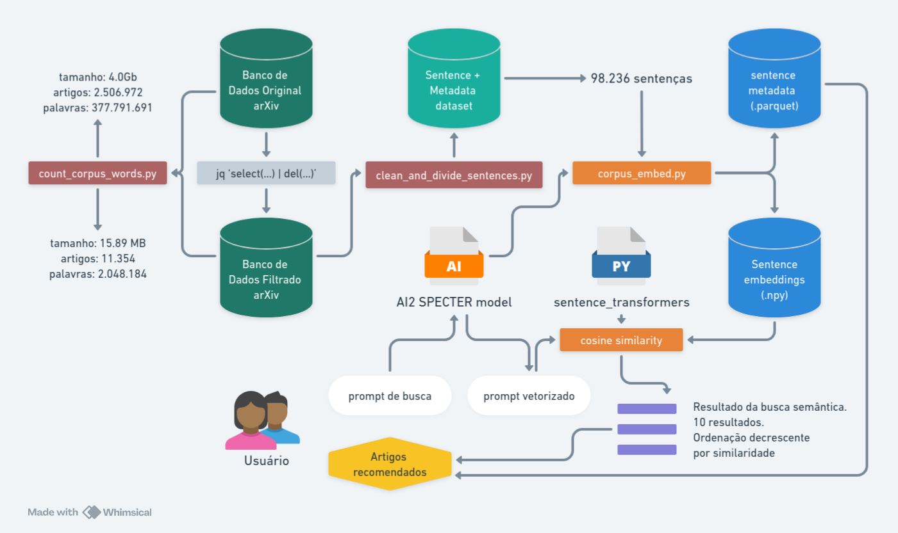

# Busca de artigos acadêmicos com similaridade semântica através de vetorização de sentenças

[](https://doi.org/10.5281/zenodo.19394259)
[](https://opensource.org/licenses/MIT)

Repositório contendo o código-fonte desenvolvido para o Trabalho de Conclusão de Curso (TCC) do **MBA USP/ESALQ em Data Science e Analytics**.

## Autoria
- **Rafael Menezes dos Santos** (Desenvolvedor)
    - contato: r.menezes@ictp-saifr.org
    - github: [r-menezes](https://github.com/r-menezes)

---

## Descrição do Projeto

A busca por literatura científica é uma etapa fundamental para a pesquisa. Contudo, com o aumento do número de artigos publicados a cada ano, os métodos tradicionais (baseados em palavras-chave) tornam-se limitados, pois dependem de anotação correta, restringem-se ao nível do documento e muitas vezes falham em captar a real proximidade semântica das ideias.

O objetivo deste projeto foi construir uma **prova de conceito** que utiliza a técnica de **vetorização de sentenças (Sentence Embeddings)** com a biblioteca `sentence_transformers` (utilizando o modelo `allenai-specter`) para permitir a **busca de textos científicos por similaridade semântica**. 

## Como Utilizar e Reproduzir os Resultados

### 1. Clonando o Repositório

Clone este repositório para a sua máquina local:

```bash
git clone https://github.com/r-menezes/citeme.git
cd citeme
```

### 2. Instalação de Dependências

Recomenda-se a utilização de um ambiente virtual (por exemplo, `venv` ou `conda`) para evitar conflitos de dependências. Para instalar os pacotes, certifique-se de ter o Python instalado e rode:

```bash
pip install -r requirements.txt
```

Isso instalará pacotes essenciais como `numpy`, `pandas`, `sentence-transformers`, `pyarrow` (para leitura de arquivos `.parquet`) e `jupyter` (para acessar os notebooks formativos).

### 3. Pipeline e Arquivos Principais


O pipeline envolve os seguintes scripts principais responsáveis pelo tratamento e análise:

- `count_corpus_words.py`: Script para análise volumétrica da base original, avaliando o tamanho do corpus, quantidade de palavras, etc.
- `clean_and_divide_sentences.py`: Responsável pelo processo de tratamento da base (remoção de caracteres especiais do LaTeX, quebras de linhas manuais) e fragmentação do texto dos artigos (como um Abstract expandido) em sentenças individuais prontas para serem vetorizadas.
- `corpus_embed.py`: Realiza a extração das "embeddings". Este script utiliza o modelo `allenai-specter` do AI2 para converter os textos fracionados em vetores matemáticos em um banco latente de conhecimento e oferece a função `search_reference` capaz de fazer o comparativo de cossenos (cosine similarity) entre um **prompt de busca** e toda a base vetorizada.

### 4. Tutorial Passo a Passo no Jupyter

A melhor maneira de conferir a eficácia das buscas e testar toda a prova de conceito é rodar o notebook `tutorial.ipynb`.
Para acessá-lo:

```bash
jupyter notebook tutorial.ipynb
```

No interior deste Notebook, você verá a importação dos módulos nativos (`CorpusEmbed`, `create_sentence_df`), o carregamento de uma base gerada a partir do parquet limpo (`data/sentence_bioPE_corpus.parquet`), além da instanciação da classe que aplica o modelo SPECTER.

Um exemplo de trecho de avaliação contido no tutorial é a busca:
_"A well mixed model does not take into account the spatial distribution of the population"_

A qual o sistema mapeia perfeitamente e encontra o artigo mais relevante para sua query a nível frase a frase.

## Conclusões do TCC

A implementação confirmou o sucesso da abordagem de proof of concept, demonstrando eficácia na recuperação correta de artigos com alto impacto de similaridade. Embora exista um desafio futuro de escalabilidade para indexar bilhões de publicações, essa prova de conceito prova a superioridade e versatilidade se expandirmos as análises para todo o escopo metodológico dos trabalhos (e não apenas usando o resumo/abstract).

Foi elaborada ainda uma interface web como site de exemplo: https://citator-ai.web.app/

---

## Agradecimentos

Agradeço ao orientador Prof. Dr. Juliano Domingues da Silva, por todo o suporte, feedbacks e orientações durante a elaboração deste trabalho.

## Licença

Este projeto é distribuído sob a Licença MIT. A comunidade pode usufruir de maneira livre deste desenvolvimento técnico e adaptá-lo livremente. Veja o arquivo `LICENSE` para mais detalhes.